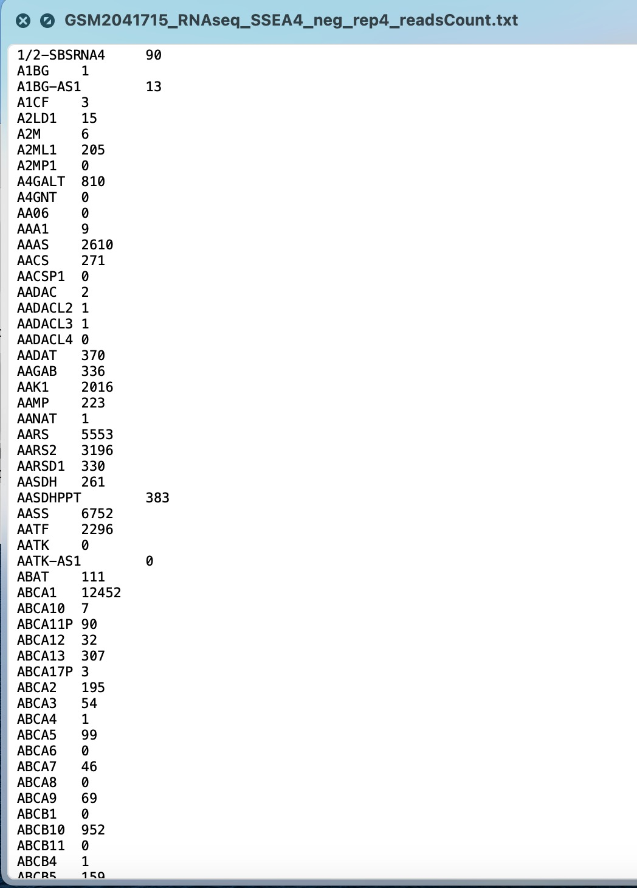

Brief description of dataset used for the project

1. Input data format for generalized RNA-seq pipeline should be RNAseq raw count data to find the differential expressed genes.
2. For downstream analysis geneList object is required for gene enrichment visualization.

the test case we use is for function find_DEG is included in the example data . The test data used for the downstream analysis is from package DOSE using data(geneList) 

# Real dataset for answering a biological question using the tool

* Question *:
Human embryonic stem cells (hESCs) typically exhibit "primed" pluripotency, analogous to stem cells derived from the mouse post-implantation epiblast. Since primed hESC have limited differentiation capacity, scientists have tried various method trying to revert "primed" hESCs to a more "naive" state which have higher pluripotency capacity (could have more clinical application potentials, and can also help us understand the early embryo development). By investigating the differentially expressed genes and their involved pathways, we hope to understand the mechanism undelying the differentiation capacity difference between naive hESCs and primed hESCs.

Here, we will use the 8 RNAseq dataset from *William Pastor et al., 2016, Cell Stem Cell*, with 4 replicates of naive hESCs and 4 replicates of primed hESCs to study the biological problem.

| Accession  | ID  | Replicate | CellType    |
|------------|-----|-----------|-------------|
|GSM2041708  | 1   |  rep1     | Primed_hESC | 
|GSM2041709  | 2   |  rep2     | Primed_hESC | 
|GSM2041710  | 3   |  rep3     | Primed_hESC | 
|GSM2041711  | 4   |  rep4     | Primed_hESC | 
|GSM2041712  | 5   |  rep1     | Naive_hESC  | 
|GSM2041713  | 6   |  rep2     | Naive_hESC  | 
|GSM2041714  | 7   |  rep3     | Naive_hESC  | 
|GSM2041715  | 8   |  rep4     | Naive_hESC  | 

* dataset Linkage *:   https://www.ncbi.nlm.nih.gov/geo/query/acc.cgi?acc=GSE76970

Each readcount txt file for every sample is roughly 90~100 kb, containing the gene names and their respect expression level. 

The reason we select the dataset is that the data is clear formulated with not much extra preprocessing steps to implement and can be used for studying differentially expressed genes, shows a clear way of how to run the pipeline.

And we expected to obtain the differentially expressed genes between the primmed and naive hESCs in a dataframe containing the adjusted p value and log2foldchange, etc. to show the confidentiality.
and visualized their subsequent pathways.

